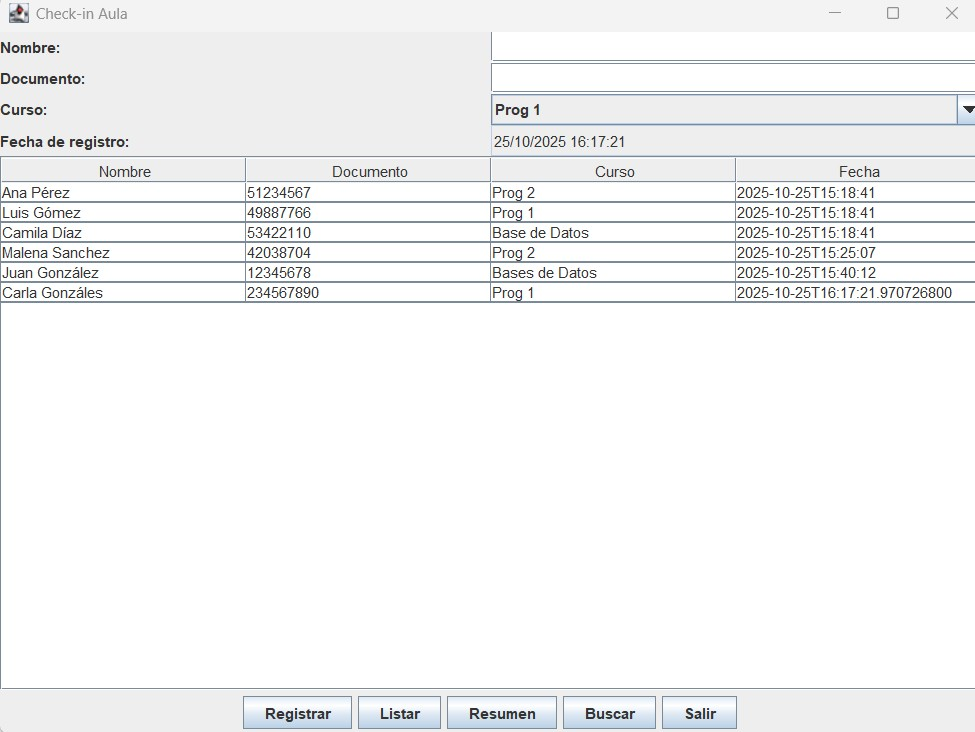
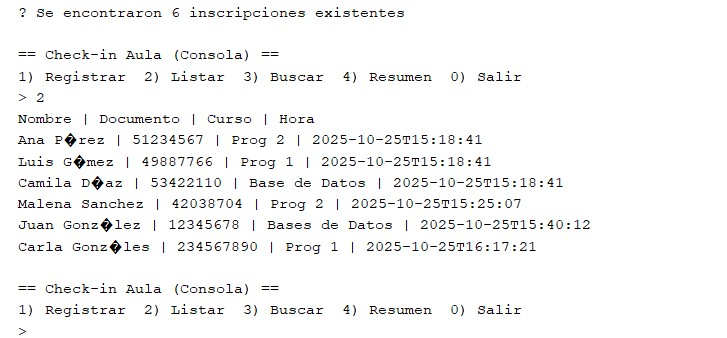
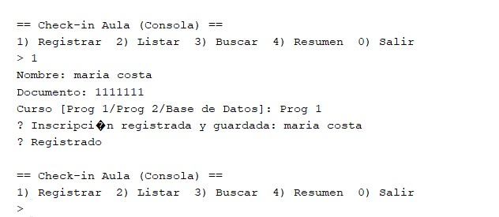
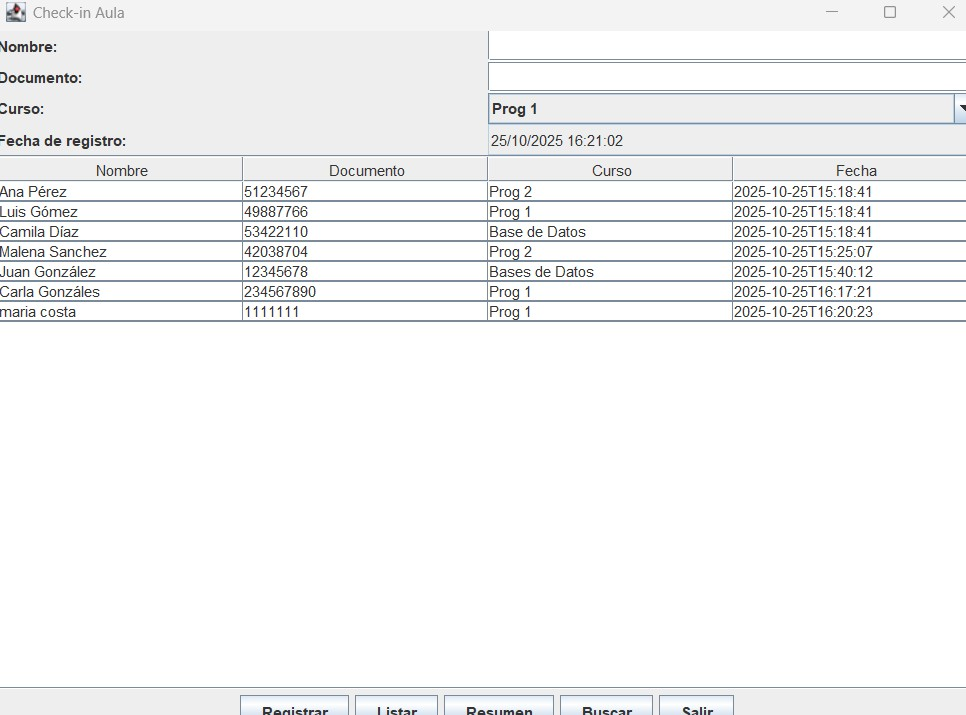

# 📚 Check-in Aula - Sistema de gestión de inscripciones con persistencia

## 🎯 Descripción del proyecto
Sistema de gestión de inscripciones para cursos académicos desarrollado en Java, con interfaz gráfica (GUI) y de consola, que permite registrar, listar, buscar y obtener resúmenes de inscripciones.

## 🛠️ Características principales

- **Doble interfaz**: ejecución por consola o interfaz gráfica (--gui)
- **Persistencia de datos**: almacenamiento automático en formato CSV
- **Gestión completa**: registro, búsqueda, listado y resúmenes
- **Arquitectura modular**: separación clara de responsabilidades

## 🗂️ Estructura del proyecto
```
src/edu/cerp/checkin/
├── model/ # Clases del modelo de datos
├── logic/ # Lógica de negocio (SesionService)
├── persistencia/ # Gestión de persistencia (ArchivoManager)
├── console/ # Interfaz de consola
├── ui/ # Interfaz gráfica (GUI)
└── App.java # Punto de entrada principal
```
## 💾 Sistema de persistencia

### 🧠 Fundamentación de la elección de persistencia

Para la persistencia de datos en este proyecto educativo, elegí el formato CSV por su simplicidad. El CSV permite visualizar directamente los datos almacenados, facilitando la depuración y comprensión del flujo de información para estudiantes. Su compatibilidad con herramientas conocidas como Excel y Google Sheets lo hace ideal para contextos educativos, donde la claridad y accesibilidad son prioritarias sobre el rendimiento. Además, el formato tabular se adapta a la estructura de las inscripciones, manteniendo la separación del diseño original sin introducir complejidades innecesarias.

### Características del sistema de guardado:

- **Formato**: CSV (Valores Separados por Comas)
- **Ubicación**: `data/inscripciones.csv`
- **Persistencia automática**: guardado tras cada registro
- **Carga inicial**: recuperación automática al iniciar la aplicación

## Formas de ejecución: 
El programa se ejecuta por consola o por interfaz gráfica (GUI). 

## Ejecución en consola:
La ejecución por consola funciona con datos precargados ("hardcodeados") y los que introduce el usuario por consola. Esto sucede cuando la siguiente línea se presenta de la siguiente forma en el archivo App.java. 

```
boolean usarGUI = false;
```
Esto indica que no se usa la interfaz gráfica. 

## Ejecución con GUI:
La ejecución por interfaz gráfica funciona con datos precargados ("hardcodeados") y los que introduce el usuario por el JFrame creado. Esto sucede cuando la siguiente línea se presenta de la siguiente forma en el archivo App.java.

```
boolean usarGUI = true;
```
Esto indica que si se usa la interfaz gráfica (=true). 

## Estructura de datos: 

En ambos casos el archivo CSV mantiene la siguiente estructura de ejemplo: 

```
nombre|documento|curso|fechaHora
Ana Pérez|51234567|Prog 2|2025-10-25 15:18:41
Luis Gómez|49887766|Prog 1|2025-10-25 15:18:41
Camila Díaz|53422110|Base de Datos|2025-10-25 15:18:41
Malena Sanchez|42038704|Prog 2|2025-10-25 15:25:07
Juan González|12345678|Bases de Datos|2025-10-25 15:40:12

```

## Configuración: 
Al archivo `.gitignore` se agregan al final estas líneas para excluir del repositorio archivos generados automáticamente por sistemas operativos y otros entornos de desarrollo. Esto se hizo con el fin de mantener el repositorio limpio y evitar conflictos, asegurando que solo se versione el código fuente del proyecto.

```
# Carpeta de datos de la aplicación Check-in
/data/

# Archivos del sistema
.DS_Store
Thumbs.db

# Archivos de IDE
.vscode/
.idea/
```
## 🖼️ Demostración de la aplicación

### Persistencia de Datos

#### Interfaz Gráfica
Además de los datos "hardcodeados" de demostración (Ana, Luis y Camila) se agregaron otros tres más:



#### Funcionamiento en Consola
Luego se ejecutó en consola y esos datos persistieron: 



Luego se agregó por consola otro registro (Maria Costa):


#### Vuelta a Interfaz Gráfica
Luego se volvió a la interfaz gráfica y el registro agregado anteriormente por consola persistió: 



## 👨‍💻 Autor
Desarrollado por la estudiante **Malena Sánchez** como parte de la asignatura **Programación 2** del CERP Sur Oeste, año 2025.
